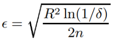
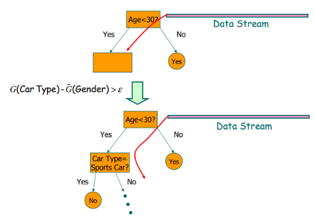
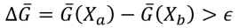

# Softskills Seminar - Mining High-Speed Data Streams

## Abstract

In this paper by Pedro Domingos and Geoff Hulten from the University of Washington it is discussed how standard knowledge discovery systems are limited in multiple factors and should not be used to extract knowledge and patterns from *big streaming data*, mainly due to memory limitations. New KDD systems should operate continuously and indefinitely, incorporating examples as they arrive and making predictions at any moment in time. Thanks to the statistical certainty given by the *Hoeffding Bound*, it is possible to build a new model, the *Hoeffding Decision Tree*, which is built incrementally and is asymptotically similar to a batch tree built on the same training dataset, with a controllable margin of error. The Hoeffding Tree is finally implemented in the *VFDT (Very Fast Decision Tree) system*, which basically extends the Hoeffding Tree with enhancements for pratictal use. Finally, some empiric results of VFDT are shown.  

## Introduction

<!-- Concepts of Data Stream Mining -->

Data streams are continuous flows of data. Examples of such streams of data are sensor data, bank transactions, call center records and so on. Their sheer volume and speed pose a great challenge for the data mining community to mine them, and the data produced by those systems is expected to grow in the next decades. Therefore, standard big data analytics based on paradigms such as Map Reduce are not sufficient anymore, while high-speed data stream mining algorithms become the new standard.

<!-- The failure of standard KDD systems -->

Knowledge discovery systems are constrained by three main limited resources: time, memory and sample size. In traditional applications of machine learning and statistics, sample size tends to be the dominant limitation. In contrast, in many (if not most) present-day data mining applications, the bottleneck is time and memory, not examples. The latter are typically in over-supply, in the sense that it is impossible with current KDD systems to make use of all of them within the available computational resources.

Currently, the most efficient algorithms available (e.g., *SPRINT* or *BIRCH*) concentrate on making it possible to mine databases that do not fit in main memory by only requiring sequential scans of the disk. But even these algorithms have only been tested on up to a few million examples.

Ideally, we would like to have KDD systems that operate continuously and indefinitely, incorporating examples as they arrive, and never losing potentially valuable information. Incremental algorithms are out there, but they are either highly sensitive to example ordering, potentially never recovering from an unfavorable set of early examples, or produce results similar to batch classification with undesired overhead in computation time.

## Hoeffding Tree

<!-- Hoeffding Tree -->

Hoeffding Trees are born from the limitations of classical decision tree learners, which assume all training data can be simultaneously stored in main memory. Hoeffding trees are based on the assumption that, in order to find the best attribute at a node, it may be sufficient to consider only a small subset of the training examples that pass through that node. Given a stream of examples, the first ones will be used to choose the root test; once the root attribute is chosen, the succeeding examples will be passed down to the corresponding leaves and used to choose the appropriate attributes there, and so on recursively.

<!-- Hoeffding bound -->

Deciding exactly how many examples are necessary at each node is still a critical point in building this kind of model. This can be done by using a statistical result known as the *Hoeffding bound*, which states that:

>Suppose we have made n independent observations of a variable *r* with domain *R*, and computed their mean *x*. The Hoeffding bound states that, with probability *1 - delta* , the true mean of the variable is at least *x - epsilon*, where:

<!-- Hoeffding Tree : example -->

Let's consider the following example.

Let *G(x)* be the heuristic measure of choice, such as *Information Gain* or *Gini Index*. Once a new example arrives is read from the data stream, the chosen heuristic measure is computed for the attributes, and the two best attributes are selected. Then, a condition on the *G* values is checked:

This condition represents that, with probability *1 - delta*, the error on the true difference in heuristic measure is very small. If the condition is met, then a new child node is created based on the best attribute. Otherwise, a new example is read from the stream.

This way, the decision tree is built incrementally, with each example requiring to be read *at most once*. The statical properties of the Hoeffding bound implies that, with high probability, a Hoeffding tree is asymptotically identical to the decision tree built by a batch learner. These characteristics make the Hoeffding Tree suitable for data stream mining, since it takes a constant time to learn an instance, and it can make class prediction in parallel.

## Very Fast Decision Tree

<!-- VFDT -->

The Hoeffding tree algorithm was implemented into *Very Fast Decision Tree* learner (VFDT), which includes some enhancements for practical use. Among the others, VFDT introduces solutions for *ties* in the computation of the heuristic measures, the expensive *recomputation of G*, and *memory occupation*.

In case of ties, potentially many examples will be required to decide between them with some confidence, which is wasteful since they’re basically equivalent. VFDT splits on the current best attribute. Recomputing G is actually pretty expensive. In VFDT it is possible to define a parameter for the minimum number of examples read before recomputing G. Memory was an issue for HT, meaning that the more the tree grew, the more memory it needed. VFDT deactivates inactive leaves, only keeping track of the probability of x falling into leaf l, times the observed error rate.

<!-- Results -->

WIP

<!-- Application : Web Caching -->

WIP

## Conclusion

<!-- Rooms for improvement -->

WIP

## Discussion

<!-- Need to find a way to know the question asked -->

WIP
